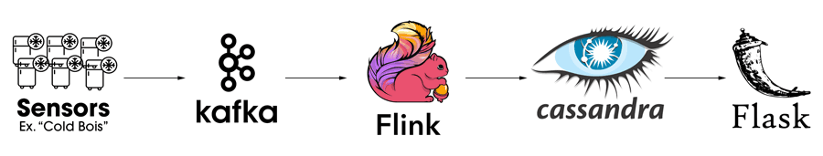

# Scrat

:squirrel:Scrat is a real-time pipeline to detect events in IoT sensor streams.

## Table of Contents

- [Overview](#overview)
- [Installation](#installation)
- [Getting Started](#getting-started)
- [Credits](#credits)

## Overview

As data streams from connected sensors have become ubiquitous it's become challenging to provide real-time analysis. Scrat is a distributed pipeline that detects patterns in streams using Apache Kafka, Flink, and Cassandra. It features:

- Event-time processing
- Complex Event Processing (CEP)
- Low latency (<100ms)

In Scrat's default configuration it processes 7,000 events/sec per m4.large node.

Scrat provides a dashboard to monitor these stream and show detected events. This repository implements the pipeline architecture to monitor temperature and energy events from refrigerators in a supermarket setting.

[Slide Deck](https://docs.google.com/presentation/d/1ijwCwPAGc8S-w-SwnXcyRyUsG7-RNzDlXh6_h3-rmho/edit?usp=sharing)



## Requirements

[AWS CLI](https://github.com/aws/aws-cli)

[Pegusus](https://github.com/InsightDataScience/pegasus)

## Installation

1. Install [Pegasus](https://github.com/InsightDataScience/pegasus), more details are provided in the [deployment README](deployment/README.md)

2. Clone this repository.
```Bash
git clone https://github.com/tyaq/scrat.git
``` 

3. Create two files in `~/.ssh/`, `sg.txt` and `subnet.txt`, with your AWS security group id, and AWS VPC subnet id.
```Bash
cd ~/.ssh/

touch sg.txt
echo 'sg-XXXXXXXX' > sg.txt

touch subnet.txt
echo 'subnet-XXXXXXXX' > subnet.txt
```

4. Run the deployment script. It will install and start the necessary technologies to your clusters.
```Bash
bash scrat/deployment/deploy.sh
```
## Getting Started

To run the pipeline exactly as I had for my demonstration run `deployment/run.sh`.

```Bash
bash scrat/deployment/run.sh
```

To customize the flink job modify `sensorStream.java` in the `processing` directory on your flink-cluster master node.

## Credits

Scrat was built as a project at Insight Data Engineering in the Winter 2018 NY session by Ishtyaq Habib. It is available as open source for anyone to use and modify.
